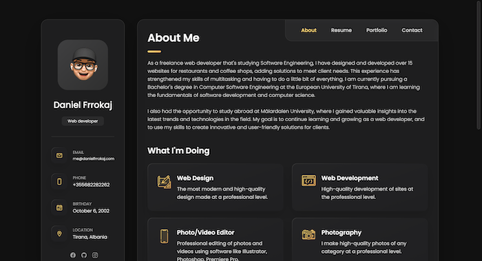

<h1>Personal Portfolio using pure HTML/CSS</h1>

In this project you can access all my documented works, it serves as a portfolio and a resume with a very modern and easy to use UI.

<h1>Screenshot</h1>

<h2>Hosting</h2>

Github

<h2>Deploy Manager & Domain</h2>

Netlify

